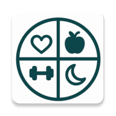

# WellnessSync - Your Holistic Wellness Companion



## Introduction

WellnessSync is a comprehensive wellness tracking application designed to provide users with a unified platform for monitoring all aspects of their health and fitness journey. Unlike fragmented solutions that require multiple apps for different health metrics, WellnessSync brings together workout tracking, nutrition planning, sleep monitoring, and mental well-being in a single, cohesive interface.

## Problem Statement

In today's fast-paced world, maintaining a balanced and healthy lifestyle can be challenging. The wellness app market is fragmented, with users often needing multiple applications to track different aspects of their health. This leads to data inconsistency, redundancy, and a frustrating user experience. WellnessSync solves this problem by offering an all-in-one solution with a clean, intuitive interface powered by modern Android development techniques.

## Core Features

### User Authentication & Profile Management
- Secure login and registration system
- Personalized user profiles with health metrics (age, height, weight)
- Dietary preference settings (vegetarian/non-vegetarian)

### Activity Tracking
- Track various activity types (workout, meditation, yoga, walking, etc.)
- Record duration, calories burned, and personal notes
- View comprehensive activity statistics and trends

### Workout Library
- Browse workouts by category (strength, cardio, flexibility, etc.)
- Filter by difficulty level (beginner, intermediate, advanced)
- Watch tutorial videos for proper form and technique
- Log completed workouts to track progress

### AI Health Assistant
- Chat with AI-powered health assistant using Google Gemini API
- Get personalized wellness tips and advice
- Maintain conversation history for future reference

### Dark Mode Support
- Toggle between light and dark themes
- Persisted theme preference

### Coming Soon
- Device synchronization with fitness trackers and wearables
- Nutrition tracking and meal planning
- Sleep quality monitoring
- Advanced wellness insights and recommendations

## Technical Implementation

### Architecture
WellnessSync is built using the MVVM (Model-View-ViewModel) architecture pattern with clean architecture principles. The app is structured into the following layers:

- **Presentation Layer**: UI components, ViewModels
- **Domain Layer**: Use cases, models, repository interfaces
- **Data Layer**: Repository implementations, data sources, DTOs

### Technologies & Libraries
- **Language**: 100% Kotlin
- **UI Framework**: Jetpack Compose for modern, declarative UI
- **Navigation**: Jetpack Navigation for handling screen transitions
- **Dependency Injection**: Hilt for dependency management
- **Database**: Room for local data persistence
- **API Communication**: Retrofit for network requests
- **Backend**: Supabase for authentication and data storage
- **AI Chat**: Google Gemini API for conversational AI
- **Video Player**: ExoPlayer for workout tutorials
- **Image Loading**: Coil for efficient image handling
- **State Management**: Kotlin Coroutines and Flow

### Directory Structure
```
├── data
│   ├── local
│   │   ├── dao
│   │   ├── database
│   │   └── entity
│   ├── preferences
│   ├── remote
│   │   ├── api
│   │   ├── datasource
│   │   └── dto
│   └── repository
├── di (Dependency Injection)
├── domain
│   ├── model
│   ├── repository
│   └── usecase
│       ├── activity
│       ├── auth
│       ├── chat
│       ├── user
│       └── workout
└── presentation
    ├── components
    ├── navigation
    ├── screens
    │   ├── activities
    │   ├── add_workout
    │   ├── auth
    │   ├── chat
    │   ├── devices
    │   ├── home
    │   ├── profile
    │   ├── splash
    │   └── workout
    ├── theme
    └── viewmodel
```

## Database Schema

The app uses both local (Room) and remote (Supabase) databases with the following main entities:

- **Users**: User profile information
- **Activities**: Logged user activities
- **Workouts**: Workout library data
- **Chat Messages**: AI assistant conversation history

## Screenshots

*Coming soon...*

## Installation & Setup

1. Clone the repository:
   ```
   git clone https://github.com/snjysbu/MobileComputing.git
   ```

2. Open the project in Android Studio Electric Eel or later.

3. Set up your Supabase and Gemini API keys:
   - Create a `keys.properties` file in the project root (not tracked by git)
   - Add your API keys:
     ```
     SUPABASE_URL="your_supabase_url"
     SUPABASE_KEY="your_supabase_key"
     GEMINI_API_KEY="your_gemini_api_key"
     ```

4. Build and run the project.

## Development Notes

### Data Synchronization
The app implements an offline-first approach. Data is stored locally with Room and synchronized with Supabase when an internet connection is available.

### Error Handling
Comprehensive error handling is implemented throughout the app with user-friendly error messages and graceful fallbacks for network issues.

### Testing
Unit tests are implemented for core business logic, ViewModels, and repositories.

## Future Enhancements

- Integration with health devices (Apple Health, Google Fit, Fitbit)
- Nutrition tracking with food database
- Advanced wellness analytics and insights
- Social sharing capabilities
- Custom workout creation

This project is part of the CP3406 Mobile App Development course assignment.

---

*Created by Sanjay Sabu, 2025*
